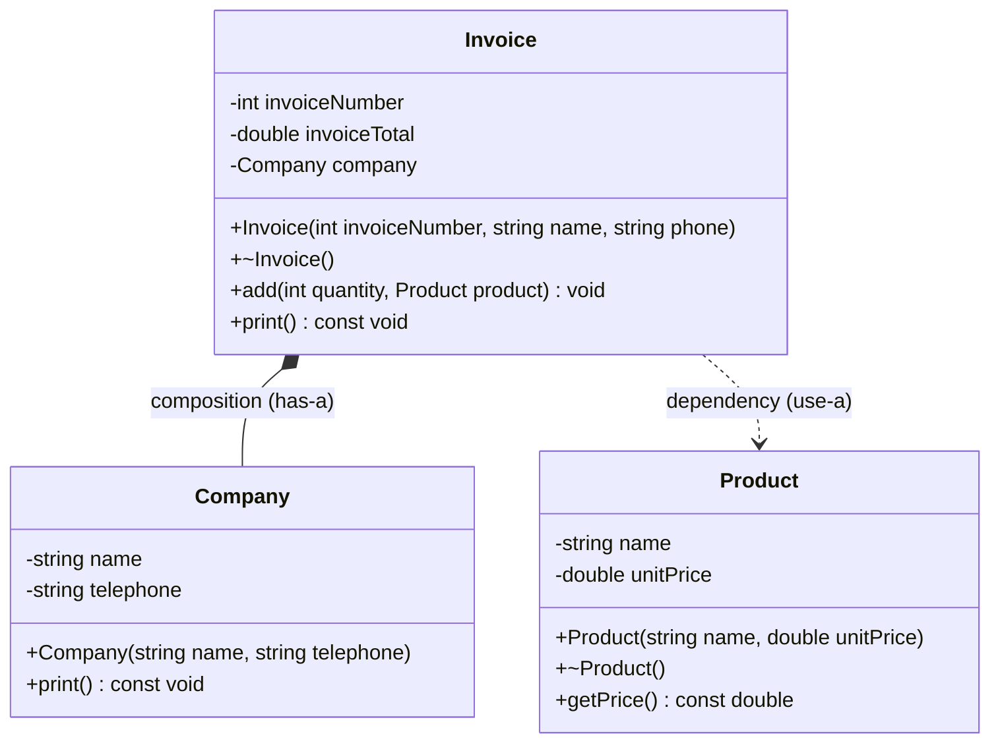

```mermaid

%%2025년도 2학기 C++ 프로그래밍 수업 원격 리포지토리


classDiagram

    class Company {

        -string name

        -string telephone

        +Company(string name, string telephone)

        +print() const void

    }

 

    class Product {

        -string name

        -double unitPrice

        +Product(string name, double unitPrice)

        +~Product()

        +getPrice() const double

    }

 

    class Invoice {

        -int invoiceNumber

        -double invoiceTotal

        -Company company

        +Invoice(int invoiceNumber, string name, string phone)

        +~Invoice()

        +add(int quantity, Product product) void

        +print() const void

    }

 

    Invoice *-- Company : composition (has-a)

    Invoice ..> Product : dependency (use-a)

```

