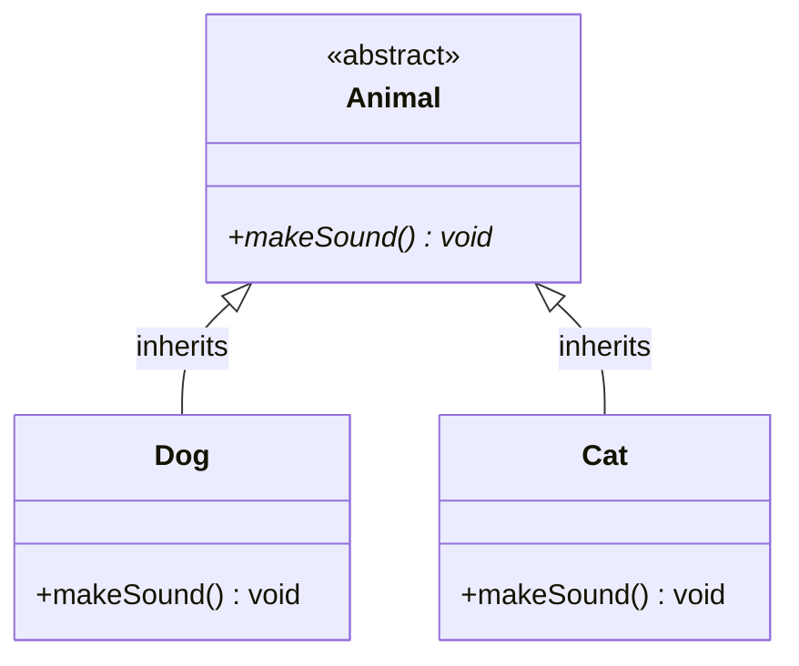

```mermaid
classDiagram
    class Animal {
        <<abstract>>
        +makeSound()* void
    }
    
    class Dog {
        +makeSound() void
    }
    
    class Cat {
        +makeSound() void
    }
    
    %% 상속 관계
    Animal <|-- Dog : inherits
    Animal <|-- Cat : inherits
    
    %% 클래스 스타일링
    class Animal {
        <<interface>>
    }   
```