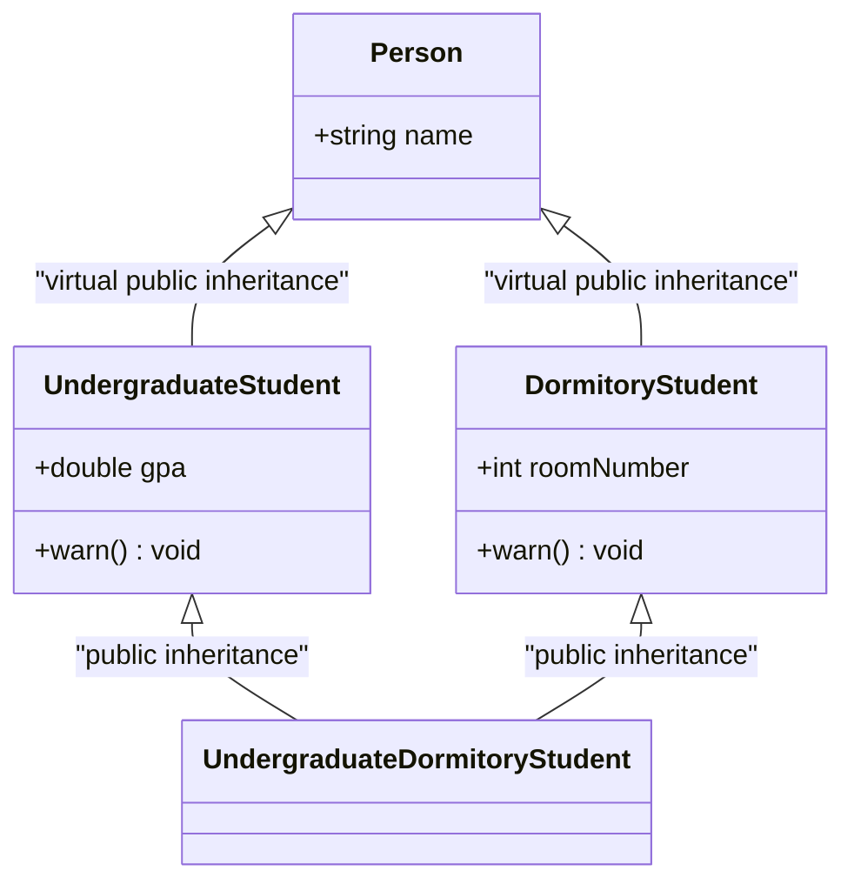

```mermaid
classDiagram
    class Person {
        +string name
    }
    
    class UndergraduateStudent {
        +double gpa
        +warn() void
    }
    
    class DormitoryStudent {
        +int roomNumber
        +warn() void
    }
    
    class UndergraduateDormitoryStudent {
        %% 상속받은 멤버들
        %% +string name (from Person)
        %% +double gpa (from UndergraduateStudent)  
        %% +int roomNumber (from DormitoryStudent)
        %% +warn() void (ambiguous - needs scope resolution)
    }
    
    %% 가상 상속 관계 (Diamond Problem 해결)
    Person <|-- UndergraduateStudent : "virtual public inheritance"
    Person <|-- DormitoryStudent : "virtual public inheritance"
    
    %% 다중 상속
    UndergraduateStudent <|-- UndergraduateDormitoryStudent : "public inheritance"
    DormitoryStudent <|-- UndergraduateDormitoryStudent : "public inheritance"
    
```